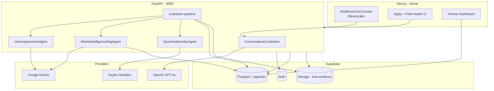

# Agri-Lend

**Voice-first, AI-powered micro-credit underwriting for Sri Lankan smallholder farmers — from field conversation to bank disbursement in minutes.**

[](https://cursor-buildathon-project-c3e8.vercel.app/)
[](https://cursor-buildathon-project-huiw.vercel.app/health)
[](https://github.com/AstrelSD/Cursor-Buildathon-Project)

Built for the **Cursor × TechTalk360 Buildathon** by **Team Fortress** — integrating **Cursor**, **ElevenLabs**, **OpenAI**, **Google Gemini**, **Vercel**, **Supabase**, and the **Seylan** hackathon banking sandbox.

| | |
|---|---|
| **Live app** | [cursor-buildathon-project-c3e8.vercel.app](https://cursor-buildathon-project-c3e8.vercel.app/) |
| **API health** | [cursor-buildathon-project-huiw.vercel.app/health](https://cursor-buildathon-project-huiw.vercel.app/health) |
| **Repository** | [github.com/AstrelSD/Cursor-Buildathon-Project](https://github.com/AstrelSD/Cursor-Buildathon-Project) |

---

## Why Agri-Lend exists

Smallholder farmers in Sri Lanka often wait **weeks** for credit decisions tied to paper forms and physical inspections. Planting windows are missed; decisions lack transparent agronomic evidence.

Agri-Lend closes the gap by fusing **what is growing in the field** (multimodal vision), **local economic risk** (district + crop vector search), and **deterministic underwriting** into one auditable pipeline — reachable by **voice** or web, without a branch visit.

---

## What it does

1. **Register** — Supabase Auth with Sri Lankan profile (`+94` phone, district).
2. **Apply** — Speak your loan needs via **ElevenLabs** (English) or use the web form; intake is parsed into structured crop, acreage, and LKR amount.
3. **Prove the field** — Upload a crop photo (JPEG/PNG/WebP, ≤10 MB) to Supabase Storage.
4. **Evaluate** — A multi-agent backend analyzes imagery and market context in parallel, scores risk, and either rejects with a clear reason or disburses via **CEFTS** (Seylan sandbox / mock).
5. **Track & repay** — Farmer dashboard with live status; repayment via **LankaQR** or **CEFTS** when configured.

---

## Highlights

| Capability | Detail |
|------------|--------|
| **Multi-agent pipeline** | Vision (Gemini) + market RAG (pgvector) + quant underwriter run in parallel |
| **Split-brain LLM design** | Gemini for vision & embeddings; GPT-4o for structured intake & audit narratives |
| **Field-health gates** | Shared rules for UI confidence bands, vision hard stops, and underwriting — low-confidence photos do not reach disbursement |
| **Deterministic risk score** | Weighted formula (health, disease, market, weather, acreage, photo quality, crop match) vs configurable threshold (default **45**) |
| **Voice-first intake** | `RealtimeVoiceConsole` + server-minted ElevenLabs signed URLs — no API keys in the browser |
| **End-to-end banking story** | CEFTS disbursement, payout account, balance inquiry, LankaQR repayment (sandbox-aware) |
| **Production-shaped ops** | Docker Compose, health checks, Vercel deploys, idempotent evaluation guards |

---

## Architecture



### Agent responsibilities

| Agent | Provider | Role |
|-------|----------|------|
| `ConversationCoordinator` | OpenAI / Gemini fallback | Voice transcript → `{ crop_type, declared_acreage, requested_amount }` |
| `VisionAgronomistAgent` | Gemini | Acreage estimate, health matrix, disease flags, photo quality, crop match |
| `MarketIntelligenceRagAgent` | Gemini embeddings + Supabase | District/crop volatility & weather via `match_market_intelligence` |
| `QuantUnderwriterAgent` | Deterministic + GPT-4o logs | Risk score, field-health band check, approve/reject, CEFTS trigger |

### Underwriting policy (field health)

Thresholds live in one place on the backend (`backend/app/vision/field_health.py`) and mirror the frontend (`frontend/lib/field-health-thresholds.ts`):

- Photo quality **≥ 40/100**, crop match **≥ 40%**
- **Low** confidence band blocks approval (and fails vision validation before underwriting)
- Composite **risk score ≤ 45** (default) required for disbursement

---

## Tech stack

| Layer | Technologies |
|-------|----------------|
| **Frontend** | Next.js 16, React 19, Tailwind CSS 4, ElevenLabs React SDK |
| **Backend** | FastAPI, Pydantic Settings, async Supabase client |
| **AI** | Google Gemini 2.5 Flash (vision), Gemini embeddings (RAG), OpenAI GPT-4o (structured intake & logs) |
| **Data** | Supabase — Postgres, Auth, Storage, Realtime, pgvector |
| **Banking** | Seylan hackathon sandbox (CEFTS, LankaQR, balance inquiry) |
| **Deploy** | Vercel (frontend + API), Docker Compose (local) |

---

## Quick start (Docker)

**Prerequisites:** Docker Desktop, Supabase project (migrations applied), API keys in env files.

1. **Clone and configure**

   ```bash
   git clone https://github.com/AstrelSD/Cursor-Buildathon-Project.git
   cd Cursor-Buildathon-Project
   cp backend/.env.example backend/.env
   cp frontend/.env.example frontend/.env
   # Fill in Supabase, Gemini, ElevenLabs, and optional OpenAI / Seylan keys
   ```

2. **Apply Supabase migrations** (SQL Editor or CLI) — files under `supabase/migrations/`.

3. **Seed market intelligence** (after DB is ready):

   ```bash
   docker compose run --rm api python scripts/seed_market_intelligence.py
   ```

4. **Run with hot reload** (recommended for development):

   ```bash
   docker compose -f docker-compose.yml -f docker-compose.dev.yml up --build
   ```

5. **Open the app**

   | Service | URL |
   |---------|-----|
   | Frontend | http://localhost:3000 |
   | API | http://localhost:8000 |
   | Health | http://localhost:8000/health |

**Production-like build** (no live reload):

```bash
docker compose up --build
```

---

## Environment variables

### Backend (`backend/.env`)

| Variable | Purpose |
|----------|---------|
| `SUPABASE_URL`, `SUPABASE_SERVICE_ROLE_KEY` | Database, storage, auth service role |
| `GOOGLE_GENAI_API_KEY` | Vision agent + market embeddings |
| `OPENAI_API_KEY` | Optional — GPT-4o underwriting narrative logs |
| `ELEVENLABS_API_KEY`, `ELEVENLABS_AGENT_ID` | Voice agent signed URLs |
| `SEYLAN_*` | Hackathon sandbox banking (CEFTS, QR, accounts) |
| `FRONTEND_URL` | CORS origin for Vercel / local frontend |
| `RISK_REJECTION_THRESHOLD` | Max risk score to approve (default `45`) |
| `MOCK_VISION_ON_FAILURE` | Demo fallback when Gemini is unavailable |

See [`backend/.env.example`](backend/.env.example) for the full list.

### Frontend (`frontend/.env`)

| Variable | Purpose |
|----------|---------|
| `NEXT_PUBLIC_API_URL` | FastAPI base URL |
| `NEXT_PUBLIC_SUPABASE_URL`, `NEXT_PUBLIC_SUPABASE_ANON_KEY` | Client-side Supabase |
| `NEXT_PUBLIC_SUPABASE_STORAGE_BUCKET` | Evidence bucket name |

See [`frontend/.env.example`](frontend/.env.example).

---

## API overview

| Method | Path | Description |
|--------|------|-------------|
| `GET` | `/health` | Service + integration readiness |
| `POST` | `/api/loans` | Create draft loan |
| `GET` | `/api/loans` | List loans for farmer |
| `POST` | `/api/loans/{id}/evidence/upload` | Upload crop image |
| `POST` | `/api/loans/{id}/evaluate` | Start async evaluation (**202**) |
| `GET` | `/api/voice/signed-url` | ElevenLabs private agent URL |
| `POST` | `/api/voice/intake` | Transcript → draft loan |
| `POST` | `/api/loans/{id}/repayment/qr` | LankaQR repayment |
| `POST` | `/api/loans/{id}/repayment/cefts` | CEFTS repayment |

Interactive docs: `http://localhost:8000/docs` when the API is running.

---

## Loan lifecycle

```
draft → analyzing → underwriting → approved → disbursed
                              ↘ rejected (with rejection_reason)
```

Re-evaluation is blocked while `analyzing`, `underwriting`, `approved`, or `disbursed`.

---

## Project structure

```
├── backend/                 # FastAPI multi-agent engine
│   ├── app/
│   │   ├── agents/          # Vision, market RAG, quant underwriter, coordinator
│   │   ├── routers/         # loans, voice, profile
│   │   ├── services/        # evaluation pipeline, Seylan, storage
│   │   └── vision/          # field health rules, calibration, image signals
│   ├── scripts/             # market seed, Seylan probes
│   └── tests/               # field health & underwriter unit tests
├── frontend/                # Next.js app (apply, dashboard, voice)
├── supabase/migrations/     # Postgres schema, RLS, pgvector RPC
├── docker-compose.yml       # Production-like stack
└── docker-compose.dev.yml   # Hot reload overlay
```

Deeper specification: [`project.md`](project.md) · Buildathon submission: [`Cursor_Buildathon_Project_Submission_Document.md`](Cursor_Buildathon_Project_Submission_Document.md)

---

## Development

### Backend (without Docker)

```bash
cd backend
python -m venv .venv
.venv\Scripts\activate          # Windows
pip install -r requirements.txt
uvicorn app.main:app --reload --port 8000
```

### Frontend (without Docker)

```bash
cd frontend
npm ci
npm run dev
```

### Tests

```bash
cd backend
python -m unittest discover -s tests -v
```

---

## Demo flow (judges & evaluators)

1. Register at `/register` with a valid `+94` mobile number and supported district.
2. Open **Apply** — use voice or the form to create a draft loan.
3. Upload a **clear daylight field photo** of the declared crop (quality ≥ 40, crop visible).
4. Submit for evaluation; watch status progress and the **field health** panel on the apply page.
5. On approval, note the **CEFTS reference** and balance on the dashboard; try repayment flows if QR/CEFTS are configured.

---

## Team Fortress

| | |
|---|---|
| **Jakshigan Jeyaseelan** | Multi-agent pipeline, Gemini vision & embeddings, Supabase schema, evaluation & API deployment |
| **Sanjula Nelumdeniyaage Dulsan** | Next.js UX, ElevenLabs voice flow, auth, dashboard, frontend deployment |

---

## Acknowledgements

- **Cursor × TechTalk360** — Buildathon track and tooling
- **Seylan Bank** — Hackathon sandbox APIs for CEFTS, QR, and account inquiry
- **ElevenLabs**, **OpenAI**, **Google**, **Vercel**, **Supabase** — Platform partners on the submission track

---

## License & status

This repository is a **hackathon prototype**. Banking integrations use sandbox/mock paths where live posting is unavailable; API routes use a service-role trust model suitable for demos, not production lending without hardening (JWT verification, stricter RLS, durable job queues).

For questions or collaboration, open an issue on [GitHub](https://github.com/AstrelSD/Cursor-Buildathon-Project).
